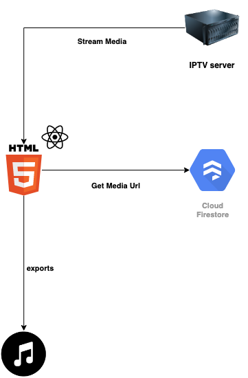
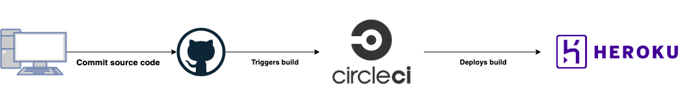

# IPTV Sampler

## Overview

IPTV Sampler takes the major inspiration from sampling in music productions.

Feel free to make audio samples with [free IPTV channels](https://github.com/iptv-org/iptv) with simplistic and material interface design

Demo hosted at https://random-sampler.herokuapp.com/

_Recommended with Firefox browser, which has full support with Web Audio APIs._

## Optional: Steps to setup before deploying
- A firebase project to host the database storing IPTV list
- A CI/CD Pipeline
- A Heroku project to host your web app \; or you can host your own with [Docker](www.docker.com)

